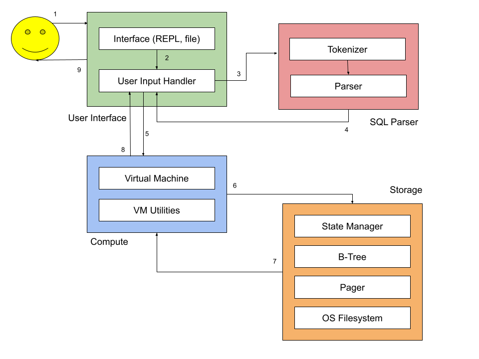

# Architecture of LearnDB

The goal of this document is to give a breakdown of the different components of `Learndb`.

We can consider Learndb an RDBMS (relational database management system)- a system for managing the storage of structured data.

## Data Flow

To better understand the architecture, let's consider how the user interacts with the system in general.
1. The user interacts via one of the many interfaces
2. Interface receives either: 1) meta command (administrative tasks) or 2) sql program (operate on database)
3. If the input in 2 was SQL, this is parsed into an AST by the SQL Parser module.
4. ^
5. AST is executed by Virtual Machine
6. Which operates on a stack of abstractions of storage, which ground out on a single file on the local file system
    - State Manager
    - B-Tree
    - Pager
    - File

## Component Breakdown

Learndb can be decomposed into the four logical areas for:
- storing data
- interfacing with user
- parsing user input (SQL)
- computing user queries over stored data

### Storage

#### Filesystem

- File system provides access to create database file
- lowest layer of storage hierarchy
- a single db corresponds to a single file
- state of the database is persisted in a single file. But for the execution
of some statement, the state is held across memory and disk. Only when the system is closed, is the state of the database
persisted to disk.

#### Pager
- manages IO to database file
- expose db file as a set of pages (fixed size blocks)
- pages are referenced by their page_number
- a page (with page number page_num) are the bytes in the file from byte offset `page_num * PAGE_SIZE` to  `(page_num + 1) * PAGE_SIZE]`

#### B-tree
- represents an ordered set of key-value pairs
- on-disk data structure, optimized for efficient insertion and retrieval of ordered data (O(lgn))
- one table corresponds to one b-tree
- a b-tree consists of multiple nodes organized in a tree structure
- a node contains many key-value pairs.
- key is the unique, orderable primary key associated with the table; value is the structure/mapping of the other column names and values.
- b-tree interfaces with pager to get pages. 
- each b-tree node corresponds 1:1 with one page
- each row (in a table) is encoded such that the key is the primary key of the table, and the value is an encoding of the rest of the columns/fields in the row 

#### State Manager
- provides a higher level abstraction over database
- understands that a database has many tables; each with a different schema and b-tree
- provides lookup to schema and b-tree, by table name, such that virtual machine can operate on them
- Understands how to read the catalog
  - catalog is a special table with a hardcorded location (page_number), which contains the definition of other tables and their locations
  - location refers to the page number
- Two levels of access: metadata (resolving table tree from name) and data (operate on a sequence of rows, that allow fast (lgn) search along certain dimensions 

### User Interface

- REPL
- file

### SQL Parser

### Parser
- converts user specified sql into an AST.
- The AST is the representation that the VM operates on.

### Compute

#### Virtual Machine (VM)
- VM executes user sql on database state
- The VM takes an AST (instructions), and a database
(represented by a file) and runs the instructions over the database, in the process evolving the database.

## Flows
Next, we will consider some typical flow, to highlight how different components interact
- define a database
- define a table
- insert some records into table
- delete some records
- read contents of a table

### Creating a Database
Currently, a database is associated with a single db file. So a database file implicitly corresponds to one database.
The database file has a header; when the header is set- database is initialized
- a file has pages
- a page is a fixed size contiguous chunk of the file.

### Defining a Table
There is a hardcoded table called catalog. Hardcoded means that it has a fixed root page number for the tree.
When the user requests a new table be created, the Virtual Machine creates a b-tree corresponding to this table; i.e. the root node of the tree is allocated and page number of the root is the location of the table.
The location along with the schema are stored in the catalog.

### Inserting Record

Virtual Machine (VM) looks up the schema of the target tables. And checks the input for schema compatibility, e.g. primary key is unique.
The key (the primary key of the table) and value (struct/dictionary of all other column name-value pairs) are serialized.
The VM then invokes the insert method on the b-tree.

### Reading Records
Virtual Machine (VM) looks up the b-tree of the requested tables. It iterates over the b-tree using a cursor and fills
a buffer with record objects. It then does a second pass over the records to create new record objects with only the requested fields.

### Deleting Records
Virtual Machine (VM) looks up the b-tree of the requested tables. It then invokes delete on the b-tree.
